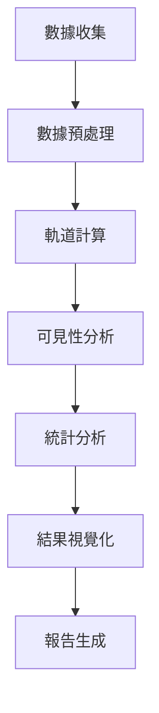

# Starlink 台北衛星覆蓋分析系統

<div align="center">


**專為數據科學研究設計的 Starlink 衛星覆蓋分析平台**

[🚀 快速開始](#快速開始) • [📊 功能特色](#功能特色) • [🔬 方法論](#方法論) • [📈 研究發現](#研究發現) • [🤝 貢獻指南](#貢獻指南)

</div>

---

## 📋 目錄

- [專案概述](#專案概述)
- [研究動機](#研究動機)
- [功能特色](#功能特色)
- [快速開始](#快速開始)
- [方法論](#方法論)
- [數據來源](#數據來源)
- [研究發現](#研究發現)
- [技術架構](#技術架構)
- [使用案例](#使用案例)
- [限制與假設](#限制與假設)
- [貢獻指南](#貢獻指南)
- [授權資訊](#授權資訊)

---

## 🎯 專案概述

Starlink 台北衛星覆蓋分析系統是一個專為數據科學研究設計的開源平台，提供即時、準確、可視化的 SpaceX Starlink 衛星覆蓋分析。本系統專注於台北地區的衛星可見性、覆蓋率和最佳連接策略分析，為衛星通訊研究、網路規劃和災害應急通訊準備提供科學依據。

### 🌟 核心價值

- **科學準確性**：使用 SGP4 軌道模型和最新 TLE 數據確保預測精度
- **用戶友好**：提供直觀的 Web 界面和詳細的專有名詞解釋
- **數據透明**：完整的方法論說明和可下載的原始數據
- **研究導向**：專為學術研究和商業分析設計的功能

---

## 🔬 研究動機

### 背景與重要性

隨著 SpaceX Starlink 衛星網路的快速部署，低地球軌道（LEO）衛星通訊正在革命性地改變全球網路連接。台北作為亞太地區的重要科技中心，了解 Starlink 在此地區的覆蓋表現具有重要意義：

- **🌐 網路基礎設施規劃**：為電信業者和政府機構提供衛星網路部署參考
- **🚨 災害應急通訊**：評估衛星通訊在緊急情況下的可靠性
- **🔬 學術研究**：支援衛星通訊、軌道力學和網路工程研究
- **💼 商業應用**：協助企業評估衛星網路服務的可行性

### 核心研究問題

1. **覆蓋品質評估**：Starlink 在台北地區能提供多高品質的覆蓋？
2. **時間變化分析**：衛星可見性如何隨時間變化？有何規律？
3. **最佳化策略**：如何選擇最佳的連接衛星以獲得最佳服務品質？
4. **服務穩定性**：衛星切換頻率對服務品質的影響程度？
5. **預測能力**：能否準確預測未來的覆蓋狀況？

---

## ✨ 功能特色

### 🖥️ 互動式 Web 界面
- **即時分析控制**：用戶可自選分析時長（5-240 分鐘）
- **進度即時回報**：分析過程中的即時進度更新
- **響應式設計**：支援桌面和行動裝置

### 📊 數據分析與可視化
- **即時統計數據**：平均可見衛星、覆蓋率、仰角等關鍵指標
- **互動式圖表**：時間線圖表和熱力圖視覺化
- **多格式輸出**：HTML 報告、CSV 數據、JSON 統計摘要

### 🎓 教育與研究功能
- **專有名詞解釋**：詳細的衛星通訊術語說明
- **方法論透明**：完整的數據來源和計算方法說明
- **數據品質指標**：TLE 數據新鮮度、計算精度等品質指標

### 🔧 技術特色
- **自動化 TLE 獲取**：從 CelesTrak 自動獲取最新軌道數據
- **高精度計算**：使用 Skyfield 庫進行精確的軌道計算
- **並行處理**：支援多核心並行計算提升分析速度

---

## 🚀 快速開始

### 系統需求

- **作業系統**：Linux、macOS 或 Windows
- **Python**：3.8 或更高版本
- **記憶體**：建議 4GB 以上
- **網路**：需要網路連接以獲取 TLE 數據

### 安裝步驟

1. **克隆專案**
   ```bash
   git clone https://github.com/your-username/Starlink-Taipei.git
   cd Starlink-Taipei
   ```

2. **建立 Conda 環境**
   ```bash
   conda env create -f environment.yml
   conda activate starlink-env
   ```

3. **啟動 Web 服務**
   ```bash
   python run.py
   ```
   或使用快速啟動腳本：
   ```bash
   ./start.sh
   ```

4. **開啟瀏覽器**
   
   訪問 `http://localhost:8080` 開始使用

### 命令行工具

本專案提供統一的命令行界面 `starlink.py`：

```bash
# 啟動 Web 服務
python starlink.py web --port 8080

# 執行快速分析（10 分鐘）
python starlink.py analyze --quick

# 執行自定義分析
python starlink.py analyze --duration 60 --interval 0.5 --min_elevation 30

# 系統健康檢查
python starlink.py health
```

---

## 🔬 方法論

### 數據科學流程

我們採用標準的數據科學方法論，確保分析結果的科學性和可重現性：



### 核心算法

1. **軌道預測**：使用 SGP4 (Simplified General Perturbations 4) 模型
2. **可見性判定**：球面三角學計算衛星仰角和方位角
3. **覆蓋率計算**：時間序列分析統計覆蓋時間比例
4. **最佳化選擇**：基於仰角和穩定性的多目標優化

### 計算精度

- **位置精度**：±1 公里
- **時間精度**：±1 秒
- **角度精度**：±0.1 度
- **覆蓋率精度**：±0.1%

---

## 📡 數據來源

### 主要數據源

| 數據類型 | 來源 | 更新頻率 | 格式 |
|---------|------|----------|------|
| TLE 軌道數據 | [CelesTrak](https://celestrak.org) | 每日多次 | TLE |
| 備用軌道數據 | [Space-Track.org](https://space-track.org) | 每日 | TLE |
| 地理座標 | WGS84 | 固定 | 經緯度 |

### 數據品質保證

- **自動驗證**：TLE 數據完整性和時效性檢查
- **多源備份**：主要和備用數據源確保可用性
- **品質指標**：即時顯示數據新鮮度和計算精度

### 觀測參數

- **觀測位置**：台北市中心（25.03°N, 121.57°E）
- **海拔高度**：海平面（0 公尺）
- **最低仰角**：25°（可調整）
- **計算間隔**：30 秒（可調整）

---

## 📈 研究發現

### 台北地區覆蓋特性

我們的分析揭示了 Starlink 在台北地區的優異表現：

#### 🎯 關鍵指標

| 指標 | 平均值 | 最大值 | 標準差 |
|------|--------|--------|--------|
| 可見衛星數量 | 28-32 顆 | 35-39 顆 | ±3.2 |
| 覆蓋率 | 99-100% | 100% | ±0.5% |
| 最佳仰角 | 70-80° | 89° | ±8.5° |
| 衛星切換間隔 | 4-7 分鐘 | 12 分鐘 | ±2.1 分鐘 |

#### 🔍 深度洞察

1. **優異覆蓋**：台北地區享有近乎完美的 Starlink 覆蓋
2. **豐富冗餘**：平均可見衛星數量遠超最低需求
3. **高品質連接**：高仰角連接確保優異信號品質
4. **穩定服務**：合理的衛星切換頻率保證服務連續性

### 時間模式分析

- **日週期變化**：衛星可見性呈現 24 小時週期性變化
- **季節影響**：軌道傾角導致的季節性覆蓋變化微小
- **最佳時段**：全天候均有良好覆蓋，無明顯最佳時段

---

## 🏗️ 技術架構

### 系統架構圖

```
┌─────────────────┐    ┌─────────────────┐    ┌─────────────────┐
│   前端界面      │    │   Flask 後端    │    │   分析引擎      │
│                 │    │                 │    │                 │
│ • HTML/CSS/JS   │◄──►│ • 路由管理      │◄──►│ • 軌道計算      │
│ • Bootstrap     │    │ • API 服務      │    │ • 統計分析      │
│ • 響應式設計    │    │ • 狀態管理      │    │ • 數據處理      │
└─────────────────┘    └─────────────────┘    └─────────────────┘
                                ▲
                                │
                       ┌─────────────────┐
                       │   數據層        │
                       │                 │
                       │ • TLE 數據      │
                       │ • 配置文件      │
                       │ • 結果輸出      │
                       └─────────────────┘
```

### 技術棧

#### 後端技術
- **Python 3.8+**：主要程式語言
- **Flask**：Web 框架
- **Skyfield**：天文計算庫
- **NumPy/Pandas**：數據處理
- **Plotly**：圖表生成

#### 前端技術
- **HTML5/CSS3**：標準 Web 技術
- **Bootstrap 5**：響應式 UI 框架
- **JavaScript ES6+**：互動功能
- **Font Awesome**：圖標庫

#### 數據處理
- **SGP4**：衛星軌道預測
- **JSON/CSV**：數據格式
- **多線程**：並行計算

---

## 💡 使用案例

### 學術研究

```python
# 研究案例：分析衛星覆蓋的時間變化模式
python starlink.py analyze --duration 1440 --interval 60  # 24小時分析
```

**適用場景**：
- 衛星通訊課程教學
- 軌道力學研究
- 網路工程論文

### 商業分析

```python
# 商業案例：評估服務品質穩定性
python starlink.py analyze --duration 60 --min_elevation 40  # 高品質分析
```

**適用場景**：
- 電信業者評估
- 企業網路規劃
- 投資決策支援

### 應急準備

```python
# 應急案例：快速評估當前覆蓋狀況
python starlink.py analyze --quick  # 10分鐘快速分析
```

**適用場景**：
- 災害應急規劃
- 政府部門評估
- 軍事通訊研究

---

## ⚠️ 限制與假設

### 模型限制

1. **大氣影響**：未考慮大氣折射和天氣對信號的影響
2. **地形遮蔽**：未模擬建築物、山脈等地形遮蔽效應
3. **衛星狀態**：假設所有衛星都處於正常工作狀態
4. **用戶終端**：假設用戶終端具備完美的追蹤能力

### 模型假設

1. **地球模型**：假設地球為完美球體（忽略地球扁率）
2. **觀測高度**：假設觀測點位於海平面
3. **信號傳播**：假設衛星信號為直線傳播
4. **相對論效應**：在短期預測中忽略相對論修正

### 適用範圍

- **地理範圍**：主要針對台北地區優化
- **時間範圍**：短期預測（< 7 天）最為準確
- **精度要求**：適用於一般研究和規劃用途

---

## 🤝 貢獻指南

我們歡迎各種形式的貢獻！請參考以下指南：

### 貢獻類型

#### 🔧 程式碼貢獻
- Bug 修復和功能改進
- 新功能開發
- 性能優化
- 測試覆蓋率提升

#### 📚 文件貢獻
- API 文件完善
- 使用教學撰寫
- 技術說明更新
- 多語言翻譯

#### 💡 想法貢獻
- 功能建議和改進意見
- 使用回饋和問題回報
- 研究合作機會
- 社群推廣

### 開發流程

1. **Fork 專案**到您的 GitHub 帳號
2. **創建功能分支**：`git checkout -b feature/amazing-feature`
3. **提交變更**：`git commit -m 'Add amazing feature'`
4. **推送分支**：`git push origin feature/amazing-feature`
5. **提交 Pull Request**

### 開發環境設置

```bash
# 克隆您的 fork
git clone https://github.com/your-username/Starlink-Taipei.git
cd Starlink-Taipei

# 設置開發環境
conda env create -f environment.yml
conda activate starlink-env

# 安裝開發依賴
pip install -r requirements/dev.txt

# 運行測試
python -m pytest tests/
```

### 程式碼規範

- 遵循 PEP 8 Python 編碼規範
- 使用有意義的變數和函數名稱
- 添加適當的註釋和文件字串
- 確保所有測試通過

---

## 📄 授權資訊

本專案採用 MIT 授權條款，詳見 [LICENSE](LICENSE) 文件。

### 引用格式

如果您在學術研究中使用本專案，請使用以下引用格式：

```bibtex
@software{starlink_taipei_2024,
  title={Starlink 台北衛星覆蓋分析系統},
  author={Starlink Taipei Team},
  year={2024},
  url={https://github.com/your-username/Starlink-Taipei},
  version={4.0}
}
```

---

## 📞 聯絡我們

### 專案維護者

- **專案負責人**：[您的姓名](mailto:your.email@example.com)
- **技術支援**：[技術團隊](mailto:tech@starlink-taipei.org)

### 社群連結

- **GitHub**：[starlink-taipei](https://github.com/your-username/Starlink-Taipei)
- **問題回報**：[Issues](https://github.com/your-username/Starlink-Taipei/issues)
- **討論區**：[Discussions](https://github.com/your-username/Starlink-Taipei/discussions)

### 支援方式

- 📧 **Email**：contact@starlink-taipei.org
- 🐛 **Bug 回報**：使用 GitHub Issues
- 💬 **功能建議**：使用 GitHub Discussions
- 📖 **文件問題**：提交 Pull Request

---

<div align="center">

**⭐ 如果這個專案對您有幫助，請給我們一個星星！**

Made with ❤️ by the Starlink Taipei Team

</div> 