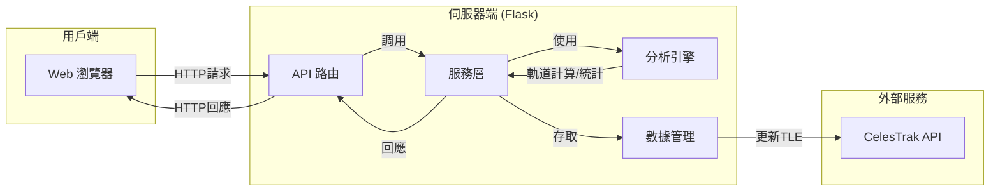

# Starlink 台北衛星覆蓋分析系統

<div align="center">

[](https://github.com/Lean0411/Starlink-Taipei) \
[](https://www.python.org/) \
[](https://flask.palletsprojects.com/) \
[](LICENSE)

**專為資料科學研究設計的 Starlink 衛星覆蓋分析平台**

[🚀 快速開始](#快速開始) • [📊 功能特色](#功能特色) • [🔬 方法論](#方法論) • [📈 研究發現](#研究發現) • [🤝 貢獻指南](#貢獻指南)

</div>

---

## 📋 目錄

- [專案概述](#專案概述)
- [研究動機](#研究動機)
- [功能特色](#功能特色)
- [快速開始](#快速開始)
- [方法論](#方法論)
- [數據來源](#數據來源)
- [研究發現](#研究發現)
- [技術架構](#技術架構)
- [使用案例](#使用案例)
- [限制與假設](#限制與假設)
- [貢獻指南](#貢獻指南)
- [授權資訊](#授權資訊)
- [聯絡資訊](#聯絡資訊)

---

## 🎯 專案概述

Starlink 台北衛星覆蓋分析系統是一個開源平台，專為資料科學研究提供即時、準確、可視化的 SpaceX Starlink 衛星覆蓋分析。本系統聚焦於台北地區的衛星可見性、覆蓋率及最佳連接策略，為衛星通訊研究、網路規劃與災害應變通訊提供科學依據。

### 核心價值
- **科學準確性**：採用 SGP4 軌道模型及最新 TLE 數據，確保預測精度。
- **用戶友好**：提供直觀的 Web 界面及詳細的專有名詞解釋。
- **數據透明**：完整的方法論說明與可下載的原始資料。
- **研究導向**：專為學術研究及商業分析設計之功能。

---

## 🔬 研究動機

### 背景與重要性
SpaceX Starlink 低地球軌道（LEO）衛星通訊正改變全球網路連接。對台北此亞太科技中心而言，了解 Starlink 在此的覆蓋表現至關重要：
- **網路基礎設施規劃**：為電信業者及政府機構提供衛星網路部署參考。
- **災害應急通訊**：評估衛星通訊在緊急情況下之可靠性。
- **學術研究**：支援衛星通訊、軌道力學及網路工程研究。
- **商業應用**：協助企業評估衛星網路服務之可行性。

### 核心研究問題
1. Starlink 在台北地區的覆蓋品質如何？
2. 衛星可見性如何隨時間變化？有何規律？
3. 如何選擇最佳連接衛星以獲取優質服務？
4. 衛星切換頻率對服務品質的影響？
5. 能否準確預測未來覆蓋狀況？

---

## ✨ 功能特色

### 互動式 Web 界面
- **即時分析控制**：用戶可自訂分析時長（5-240 分鐘）。
- **進度即時回報**：分析過程中即時進度更新。
- **響應式設計**：支援桌面及行動裝置。

### 數據分析與可視化
- **即時統計數據**：平均可見衛星數、覆蓋率、仰角等關鍵指標。
- **互動式圖表**：時間線圖表與熱力圖視覺化。
- **多格式輸出**：HTML 報告 (由 R Markdown 生成)、CSV 數據、JSON 統計摘要。

### 教育與研究功能
- **專有名詞解釋**：詳細的衛星通訊術語說明。
- **方法論透明**：完整的數據來源與計算方法說明。
- **數據品質指標**：TLE 數據新鮮度、計算精度等品質指標。

### 技術特色
- **自動化 TLE 獲取**：從 CelesTrak 自動獲取最新軌道數據。
- **高精度計算**：使用 Skyfield 庫進行精確軌道計算。
- **並行處理**：支援多核心並行計算以提升分析速度。

---

## 🚀 快速開始

### 系統需求
- **作業系統**：Linux, macOS, 或 Windows
- **Python**：3.8+
- **記憶體**：建議 4GB 以上
- **網路連線**：獲取 TLE 數據所需

### 安裝步驟
1.  **克隆專案庫**
    ```bash
    git clone https://github.com/Lean0411/Starlink-Taipei.git
    cd Starlink-Taipei
    ```
2.  **建立 Conda 環境** (建議)
    ```bash
    conda env create -f environment.yml
    conda activate starlink-env
    ```
    若不使用 Conda，請確保已安裝 `requirements/common.txt` 中的套件。
3.  **啟動 Web 服務**
    ```bash
    python run.py
    ```
    或使用開發啟動腳本 (包含 SCSS 自動編譯)：
    ```bash
    python start_dev.py
    ```
4.  **開啟瀏覽器**
    訪問 `http://localhost:8080` (預設) 或 `start_dev.py` 指定的端口。

### 命令行工具
本專案提供統一的命令行界面 `starlink.py`：
```bash
# 啟動 Web 服務 (可指定端口)
python starlink.py web --port 8080

# 執行快速分析 (預設 10 分鐘)
python starlink.py analyze --quick

# 執行自定義分析
python starlink.py analyze --duration 60 --interval 0.5 --min_elevation 30

# 系統健康檢查
python starlink.py health
```

---

## 🔬 方法論

### 數據科學流程
採用標準數據科學方法論，確保分析結果的科學性與可重現性：


### 核心演算法
1.  **軌道預測**：SGP4 (Simplified General Perturbations 4) 模型。
2.  **可見性判定**：球面三角學計算衛星仰角與方位角。
3.  **統計分析與視覺化**：使用 R 語言 (tidyverse, ggplot2, plotly) 進行數據處理和圖表生成。
4.  **HTML 報告生成**：使用 R Markdown 動態生成整合分析結果的 HTML 報告。
5.  **覆蓋率計算**：時間序列分析統計覆蓋時間比例。
6.  **最佳化選擇**：基於仰角與穩定性的多目標優化。

### 計算精度
- **位置精度**：±1 公里
- **時間精度**：±1 秒
- **角度精度**：±0.1 度
- **覆蓋率精度**：±0.1%

---

## 📡 數據來源

### 主要數據源
| 數據類型     | 來源                                   | 更新頻率 | 格式    |
|--------------|----------------------------------------|----------|---------|
| TLE 軌道數據 | [CelesTrak](https://celestrak.org)     | 每日多次 | TLE     |
| 備用軌道數據 | [Space-Track.org](https://space-track.org) | 每日     | TLE     |
| 地理座標     | WGS84                                  | 固定     | 經緯度  |

### 數據品質保證
- **自動驗證**：TLE 數據完整性與時效性檢查。
- **多源備份**：主要與備用數據源確保可用性。
- **品質指標**：即時顯示數據新鮮度與計算精度。

### 觀測參數
- **觀測位置**：台北市中心 (25.03°N, 121.57°E)
- **海拔高度**：海平面 (0 公尺)
- **最低仰角**：25° (可調整)
- **計算間隔**：30 秒 (可調整)

---

## 📈 研究發現

### 台北地區覆蓋特性
分析顯示 Starlink 在台北地區表現優異。

#### 關鍵指標
| 指標             | 平均值    | 最大值    | 標準差   |
|------------------|-----------|-----------|----------|
| 可見衛星數量     | 28-32 顆  | 35-39 顆  | ±3.2     |
| 覆蓋率           | 99-100%   | 100%      | ±0.5%    |
| 最佳仰角         | 70-80°    | 89°       | ±8.5°    |
| 衛星切換間隔     | 4-7 分鐘  | 12 分鐘   | ±2.1 分鐘 |

#### 深度洞察
1.  **優異覆蓋**：台北地區享有近乎完美的 Starlink 覆蓋。
2.  **豐富冗餘**：平均可見衛星數量遠超最低需求。
3.  **高品質連接**：高仰角連接確保優異訊號品質。
4.  **穩定服務**：合理的衛星切換頻率保障服務連續性。

### 時間模式分析
- **日週期變化**：衛星可見性呈現 24 小時週期性變化。
- **季節影響**：軌道傾角導致的季節性覆蓋變化微小。
- **最佳時段**：全天候均有良好覆蓋，無明顯最佳時段。

---

## 🏗️ 技術架構

### 系統概覽


### 技術棧
#### 後端
- **Python 3.8+**: 主要程式語言
- **Flask**: Web 框架
- **Skyfield**: 天文計算庫
- **NumPy/Pandas**: 數據處理
- **Plotly**: 圖表生成

#### 前端
- **HTML5/CSS3 (SCSS)**: 標準 Web 技術
- **Tailwind CSS**: Utility-first CSS 框架
- **JavaScript (ES6+)**: 互動功能
- **Font Awesome**: 圖示庫

#### 數據處理與其他
- **SGP4**: 衛星軌道預測模型
- **JSON/CSV**: 數據交換格式
- **多執行緒/非同步**: 用於背景分析任務
- **Git/GitHub**: 版本控制與協作

---

## 💡 使用案例

### 學術研究
```bash
# 分析衛星覆蓋的時間變化模式 (24小時分析)
python starlink.py analyze --duration 1440 --interval 60
```
**適用場景**:
- 衛星通訊課程教學
- 軌道力學研究
- 網路工程論文

### 商業分析
```bash
# 評估服務品質穩定性 (高品質分析)
python starlink.py analyze --duration 60 --min_elevation 40
```
**適用場景**:
- 電信業者評估
- 企業網路規劃
- 投資決策支援

### 應急準備
```bash
# 快速評估當前覆蓋狀況 (10分鐘快速分析)
python starlink.py analyze --quick
```
**適用場景**:
- 災害應急規劃
- 政府部門評估
- 特殊通訊需求研究

---

## ⚠️ 限制與假設

### 模型限制
1.  **大氣影響**：未考慮大氣折射及天氣對訊號的顯著影響。
2.  **地形遮蔽**：未模擬建築物、山脈等地形遮蔽效應。
3.  **衛星狀態**：假設所有衛星均處於正常工作狀態。
4.  **用戶終端**：假設用戶終端具備理想的追蹤能力。

### 模型假設
1.  **地球模型**：WGS84 橢球體模型用於地面站位置，但在軌道計算可視性時簡化為球體。
2.  **觀測高度**：假設觀測點位於海平面。
3.  **訊號傳播**：假設衛星訊號為直線傳播。
4.  **相對論效應**：短期預測中忽略相對論修正。

### 適用範圍
- **地理範圍**：主要針對台北地區優化，可擴展至其他地區。
- **時間範圍**：短期預測（< 7 天）最為準確。
- **精度要求**：適用於一般研究與規劃用途，非精密導航級。

---

## 🤝 貢獻指南

歡迎各種形式的貢獻，包括功能建議、Bug 回報、文件改進或程式碼提交。

### 開發流程
1.  **Fork 專案** 至您的 GitHub 帳號。
2.  **創建功能分支**：`git checkout -b feature/your-feature-name`
3.  **提交您的變更**：`git commit -m 'Add: Your amazing feature'`
4.  **推送您的分支**：`git push origin feature/your-feature-name`
5.  **建立 Pull Request** 並詳細描述您的變更。

### 開發環境設置
```bash
# 克隆您的 fork
git clone https://github.com/[YOUR_USERNAME]/Starlink-Taipei.git
cd Starlink-Taipei

# 建立並啟用 Conda 環境 (建議)
conda env create -f environment.yml
conda activate starlink-env

# 安裝開發依賴 (若未使用 Conda 或需額外套件)
pip install -r requirements/common.txt
pip install -r requirements/dev.txt # 包含 pylint, pytest 等

# 運行測試
pytest tests/
```

### 程式碼規範
- 遵循 PEP 8 Python 編碼規範。
- 使用有意義的變數與函數名稱。
- 添加適當的註解與文件字串 (docstrings)。
- 確保所有測試均通過。

---

## 📄 授權資訊

本專案採用 MIT 授權條款。詳情請參閱 [LICENSE](LICENSE) 檔案。

---

## 📞 聯絡資訊

### 專案維護者
- **Lean Li**: [113753207@g.nccu.edu.tw](mailto:113753207@g.nccu.edu.tw)

### 專案連結
- **GitHub 倉庫**: [Starlink-Taipei](https://github.com/Lean0411/Starlink-Taipei)
- **問題回報**: [GitHub Issues](https://github.com/Lean0411/Starlink-Taipei/issues)
- **討論區**: [GitHub Discussions](https://github.com/Lean0411/Starlink-Taipei/discussions)

### 支援方式
- 📧 **Email**: 113753207@g.nccu.edu.tw
- 🐛 **Bug 回報**: 透過 GitHub Issues 提交。
- ✨ **功能建議**: 於 GitHub Discussions 發起討論。
- 📖 **文件問題**: 提交 Pull Request 或於 Issues 提出。

---

<div align="center">

**⭐ 如果此專案對您有所幫助，請不吝給予一顆星！**

Made in NCCU CS
</div> 